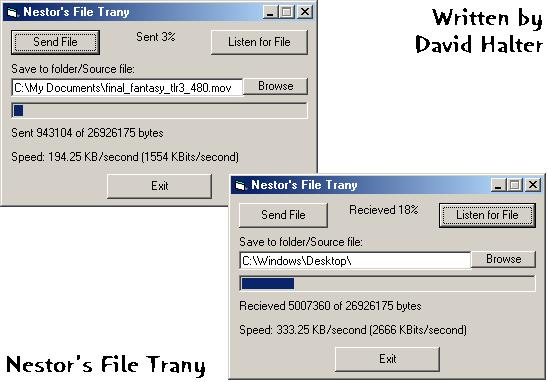



## Simple File Transfer

### Description

This is a simple file transfer using the winsock control. It can resume a download if canceled or disconnected. I have seen other file transfer code on planet source code, but I felt I needed to write one with resume.
 
### More Info
 
Files on the sending end.

Sending files: make sure it is a path to the file with the file name.

Recieving files: Make sure you just have the path.

Files on the recieving end.

Little buggy if not used right.

             |
---                |---
**Submitted On**   |2001-05-12 20:06:38
**By**             |[David Halter](https://github.com/Planet-Source-Code/PSCIndex/blob/master/ByAuthor/david-halter.md)
**Level**          |Intermediate
**User Rating**    |4.7 (75 globes from 16 users)
**Compatibility**  |VB 5\.0, VB 6\.0
**Category**       |[Internet/ HTML](https://github.com/Planet-Source-Code/PSCIndex/blob/master/ByCategory/internet-html__1-34.md)
**World**          |[Visual Basic](https://github.com/Planet-Source-Code/PSCIndex/blob/master/ByWorld/visual-basic.md)
**Archive File**   |[Simple Fil195695132001\.zip](https://github.com/Planet-Source-Code/david-halter-simple-file-transfer__1-23106/archive/master.zip)

### API Declarations

Sleep

